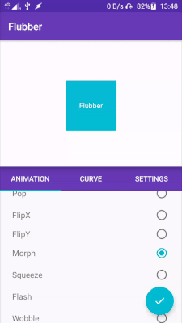
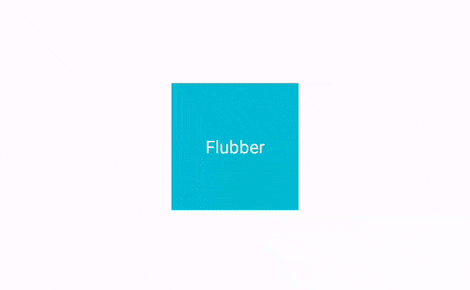
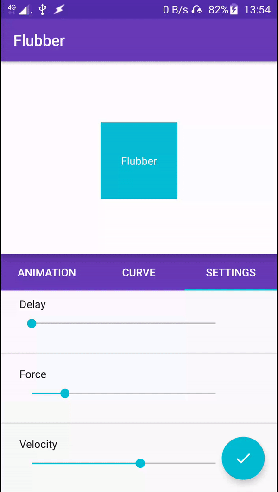
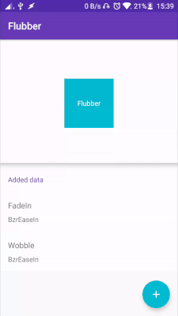
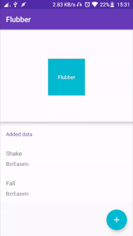

Flubber
===


Flubber is an elegant solution for making animations in Android. The library is inspired by the [Spring](https://github.com/MengTo/Spring) library for iOS. It supports all of the animations, curves and properties that are present in Spring. The library provides an interpolator called Spring which is similar to the iOS [CASpringAnimation](https://developer.apple.com/documentation/quartzcore/caspringanimation).

The library is developed and maintained by [Appolica](http://www.appolica.com/).

  



Download
[  ](https://bintray.com/appolica-ltd/appolica/Flubber/_latestVersion)
---
### Gradle
`    implementation 'com.appolica:flubber:1.0.1'`
### Maven
```xml
<dependency>
  <groupId>com.appolica</groupId>
  <artifactId>flubber</artifactId>
  <version>1.0.1</version>
  <type>aar</type>
</dependency>
```

Example
---
1. Add the library to your build file. If you're using gradle it would look like this:
```groovy
dependencies {
`    implementation 'com.appolica:flubber:1.0.1'`
}
```
2. Add a view which you want to be animated: 
```xml
    <TextView
        android:id="@+id/text"
        android:layout_centerInParent="true"
        android:text="Hello World!"
        android:gravity="center"/>

```
3. Get the view
```java
View view = findViewById(R.id.text);
```
4. Apply the flubber animation where you want it to happen(in this example, when the view is clicked):
```java
view.setOnClickListener(new View.OnClickListener() {
    @Override
    public void onClick(View v) {
	Flubber.with()
		.animation(Flubber.AnimationPreset.SLIDE_UP) // Slide up animation
		.repeatCount(1)                              // Repeat once
		.duration(1000)                              // Last for 1000 milliseconds(1 second)
		.createFor(view)                             // Apply it to the view
		.start();                                    // Start it now
    }
});
```

API
-----
### `class Flubber`

This is the main class you will use to create your animations.
<a name=flubber.with>
##### `public static AnimationBody.Builder with()` </a>
 Used to get a new `AnimationBody.Builder` instance. With it you can create an `AnimationBody` which holds all the data for an animation. Example:
```java
Flubber.with()
	   .animation(Flubber.AnimationPreset.MORPH)
	   .interpolator(Flubber.Curve.BZR_EASE_IN)
	   .duration(100)
	   .autoStart(true)
	   .createFor(viewToBeAnimated);
```
This will create an animation from the [preset animation `MORPH`](#enum-animationpreset) with an interpolator from the [preset interpolator `BZR_EASE_IN`](#enum-curve). It will have a duration of 100 milliseconds and it will start automatically. The view which will be animated is `viewToBeAnimated`.
More about the properties of the [`AnimationBody`](#class-animationbody).

#### `enum AnimationPreset`
An enum containing all of the preset animations. Available options are:

* `SLIDE_LEFT`
* `SLIDE_RIGHT`
* `SLIDE_DOWN`
* `SLIDE_UP`
* `SQUEEZE_LEFT`
* `SQUEEZE_RIGHT`
* `SQUEEZE_DOWN`
* `SQUEEZE_UP`
* `FADE_IN`
* `FADE_OUT`
* `FADE_OUT_IN`
* `FADE_IN_LEFT`
* `FADE_IN_RIGHT`
* `FADE_IN_DOWN`
* `FADE_IN_UP`
* `ZOOM_IN`
* `ZOOM_OUT`
* `FALL`
* `SHAKE`
* `POP`
* `FLIP_X`
* `FLIP_Y`
* `MORPH`
* `SQUEEZE`
* `FLASH`
* `WOBBLE`
* `SWING`
* `ALPHA`
* `ROTATION`
* `TRANSLATION_X`
* `TRANSLATION_Y`
* `SCALE_X`
* `SCALE_Y`


#### `enum Curve`
An enum containing all of the preset curves. Available options are:

* `BZR_EASE_IN`
* `BZR_EASE_OUT`
* `BZR_EASE_IN_OUT`
* `BZR_LINEAR`
* `BZR_SPRING`
* `BZR_EASE_IN_SINE`
* `BZR_EASE_OUT_SINE`
* `BZR_EASE_IN_OUT_SINE`
* `BZR_EASE_IN_QUAD`
* `BZR_EASE_OUT_QUAD`
* `BZR_EASE_IN_OUT_QUAD`
* `BZR_EASE_IN_CUBIC`
* `BZR_EASE_OUT_CUBIC`
* `BZR_EASE_IN_OUT_CUBIC`
* `BZR_EASE_IN_QUART`
* `BZR_EASE_OUT_QUART`
* `BZR_EASE_IN_OUT_QUART`
* `BZR_EASE_IN_QUINT`
* `BZR_EASE_OUT_QUINT`
* `BZR_EASE_IN_OUT_QUINT`
* `BZR_EASE_IN_EXPO`
* `BZR_EASE_OUT_EXPO`
* `BZR_EASE_IN_OUT_EXPO`
* `BZR_EASE_IN_CIRC`
* `BZR_EASE_OUT_CIRC`
* `BZR_EASE_IN_OUT_CIRC`
* `BZR_EASE_IN_BACK`
* `BZR_EASE_OUT_BACK`
* `BZR_EASE_IN_OUT_BACK`
* `SPRING`
* `LINEAR`

### `class AnimationBody`
This class contains all of the properties of a given animation. All of them are accessible from the [`AnimationProvider`](#interface-animationprovider).

* `autoStart` - Determines if the animation will start before returning it from [`createFor()`](#createFor).
* `force` - The force of the animation. Used by most of the presets to determine how much to express the animation (rotate the view more, wobble harder, etc...).
* `damping` - Used only by the spring interpolator to determine the stiffness of the spring.
* `velocity` - Used only be the spring interpolator to determine the initial velocity of the spring.
* `startX/Y` - Used only by the translation animation presets to determine where the translation starts.
* `endX/Y` - Used only by the translation animation presets to determine where the translation ends.
* `startScaleX/Y` - Used only by the scaling animation presets to determine the initial scale.
* `endScaleX/Y` - Used only by the scaling animation presets to determine the finishing scale.
* `repeatCount` - Used by the [`BaseProvider`](#baseprovider) class to set how many times the animation is repeated.
* `repeatMode` - Used by the [`BaseProvider`](#baseprovider) class to set how the animation is repeated(restart or reverse).
* `delay` - Sets the delay of the animation.
* `duration` - Sets the duration of the animation.
* `animation` - Sets the [`AnimationProvider`](#interface-animationprovider) for the animation.
* `iterpolatorProvider` - Sets the [`InterpolatorProvider`](#interface-interpolatorprovider) for the animation.
* `animatorListener` - Sets an animator listener for the animation

<a name=createFor></a>
##### `public Animator createFor(View view)`
Uses all of the properties to create an animation for the given view. If the `autoStart` property is enabled the animation will be started from this method otherwise the animation must be started after it is returned.

### `interface AnimationProvider`
##### `public Animator createAnimationFor(final AnimationBody animationBody, View view)`

Must create an Animator instance for the given `view` from the `animationBody`. If you want you can use this interface to create new animations but it is recomended to use the [`BaseProvider`](#baseprovider) class because it implements animation repetition and applies the interpolator. Example:
```java
    public Animator createAnimationFor(AnimationBody animationBody, View view) {

        final ObjectAnimator alphaAnimation = ObjectAnimator.ofFloat(view, View.ALPHA, 0f, 1f);

        return alphaAnimation;
    }

```

<a name=baseprovider></a>
### `abstract class BaseProvider`
##### `public abstract Animator getAnimationFor(AnimationBody animationBody, View view)`
Should create the animation for the given `view` from the `animationBody` the same as `createAnimationFor()` but it is not necessary to set the animation's repeating and interpolation info because it is handled by the `BaseProvider` class.

### `interface InterpolatorProvider`
##### `public Interpolator createInterpolatorFor(final AnimationBody animationBody)`
Should provide an anumation interpolator based on the given `animationBody`. Example:
```java
public Interpolator createInterpolatorFor(AnimationBody animationBody) {
    final float force = animationBody.getForce();
    return PathInterpolatorCompat.create(0.5f, 1.1f + force / 3, 1f, 1f);
}
```

### `class SimpleAnimatorListener`
This is a helper class you can use if you don't want to override all of the `AnimatorListener` methods. It provides four methods with callbacks for the for events in an `AnimatorListener`.
```java
static Animator.AnimatorListener forStart(final OnAnimationStartListener startListener);
```

```java
static Animator.AnimatorListener forEnd(final OnAnimationEndListener endListener);
```

```java
static Animator.AnimatorListener forCancel(final OnAnimationCancelListener cancelListener);
```

```java
static Animator.AnimatorListener forRepeat(final OnAnimationRepeatListener repeatListener);
```

# License
The library is under the Apache license. Check the [LICENSE](./LICENSE) file for more info.
